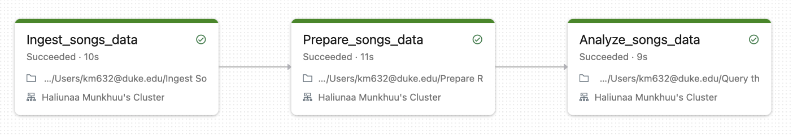

# Data Pipeline with Databricks (Week 11)
Currently, I am enhancing my skills in creating data pipelines using Databricks. My learning process involves following the tutorial available on the Databricks website which shows how to ingest raw data, transform the data, and query the data.

## References
Link to the tutorial: 
https://docs.databricks.com/en/getting-started/data-pipeline-get-started.html

## Dataset
Following the tutorial, I used the sample data provided within the Databricks. The dataset name is Million Song Dataset, and it contains details such as release data and artist's name. 

## Project Workflow Steps

Step 1. Ingest the Dataset

In this step, I explicitely defined the data schema and ingest using the following code: 

```
(spark.readStream
  .format("cloudFiles")
  .schema(schema)
  .option("cloudFiles.format", "csv")
  .option("sep","\t")
  .load(file_path)
  .writeStream
  .option("checkpointLocation", checkpoint_path)
  .trigger(availableNow=True)
  .toTable(table_name)
)
```

Step 2. Transform the Dataset
 
Next, I create another table with specific set of columns and insert the data into it from the previously created raw data table. I utilized Databricks ability to run SQL commands directly. 


Step 3. Query to Analyze

Another SQL based notebook was created for this step. Here we analyze the data to understand the which artist released the most amount of songs each year and find songs for the DJ list. 

Once steps 1-3 are completed, I created a Databricks job to run the pipeline. 


